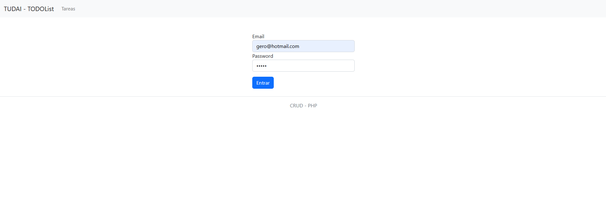
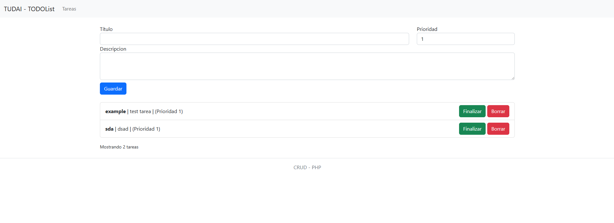

# Aplicación de Lista de Tareas (To-Do List)

Aplicación web para gestionar una lista de tareas. Construida desde cero con **PHP puro** para demostrar mis conocimientos en desarrollo backend, la arquitectura **Modelo-Vista-Controlador (MVC)** y la interacción con bases de datos.

El objetivo era crear una aplicación funcional y bien estructurada, siguiendo buenas prácticas de desarrollo.

| Pantalla de Login | Tareas |
|:---:|:---:|
|  |  |

##  Tecnologías Utilizadas

*   **Backend:** PHP
*   **Base de Datos:** MySQL (con PDO para la conexión)
*   **Frontend:** HTML, CSS, Bootstrap 5
*   **Arquitectura:** MVC (Modelo-Vista-Controlador)

##  Funcionalidades Clave

*   **Gestión de Usuarios:** Sistema completo de registro e inicio de sesión.
*   **Operaciones CRUD:** Los usuarios pueden **C**rear, **L**eer, **A**ctualizar (marcar como finalizada) y **E**liminar tareas.
*   **Rutas Protegidas:** La lista de tareas solo es accesible para usuarios que han iniciado sesión.
*   **Interfaz Clara:** Diseño simple y responsivo gracias a Bootstrap.
